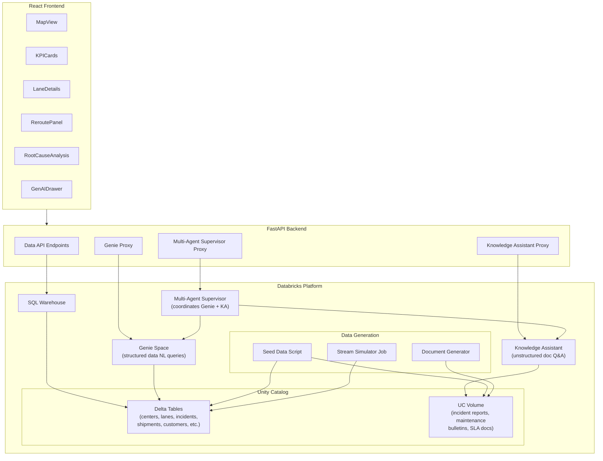

# Databricks Services Integration Plan

## Architecture Overview




---

## Part 1: Delta Tables and Data Layer

### 1.1 Unity Catalog Structure

Create catalog `logistics_demo` with schema `network_ops`:

**Tables** (matching current TypeScript types in [src/types/domain.ts](src/types/domain.ts)):

- `centers` -- distribution hubs (20 rows, mostly static)
- `lanes` -- shipping lanes with live metrics (35 rows, updated by stream)
- `incidents` -- active/historical incidents (continuously appended by stream)
- `shipments` -- package tracking (continuously updated by stream)
- `reroute_solutions` -- pre-computed reroute options (refreshed periodically)
- `customers` -- customer profiles with tier, preferences
- `customer_interactions` -- interaction log (emails, calls, meetings)
- `capacity_lanes` -- capacity metrics per lane (updated by stream)
- `capacity_actions` -- optimization actions (generated by stream)
- `agent_activities` -- agent action audit log
- `sales_opportunities` -- sales pipeline

### 1.2 New Files

Create `databricks/` directory at project root:

```
databricks/
  config.py                  # Shared constants (catalog, schema, table names)
  setup_catalog.py           # Create catalog, schema, tables (DDL)
  seed_data.py               # Load initial data from public/mock/*.json
  stream_simulator.py        # Continuous data mutation (runs as Databricks Job)
  generate_documents.py      # Create unstructured docs for Knowledge Assistant
  README.md                  # Setup instructions
```

### 1.3 Table DDL (in `setup_catalog.py`)

Each table maps 1:1 to the existing TypeScript interfaces. Key schema examples:

```sql
CREATE TABLE IF NOT EXISTS logistics_demo.network_ops.lanes (
  id STRING NOT NULL,
  origin STRING NOT NULL,
  dest STRING NOT NULL,
  mode STRING NOT NULL,  -- 'air' | 'ground'
  avgDailyVolume INT,
  onTimePct DOUBLE,
  delayMinutes INT,
  slaRiskPct DOUBLE,
  updated_at TIMESTAMP DEFAULT current_timestamp()
);

CREATE TABLE IF NOT EXISTS logistics_demo.network_ops.incidents (
  id STRING NOT NULL,
  laneId STRING NOT NULL,
  timestamp TIMESTAMP NOT NULL,
  type STRING NOT NULL,
  ref STRING,
  cause STRING,
  impactMinutes INT,
  impactThroughputPct DOUBLE,
  confidence DOUBLE,
  active BOOLEAN DEFAULT true,
  created_at TIMESTAMP DEFAULT current_timestamp()
);

CREATE TABLE IF NOT EXISTS logistics_demo.network_ops.shipments (
  trackingId STRING NOT NULL,
  customerId STRING NOT NULL,
  priority STRING NOT NULL,  -- 'LOW' | 'MED' | 'HIGH'
  laneId STRING NOT NULL,
  promisedETA TIMESTAMP,
  currentETA TIMESTAMP,
  packageCount INT,
  status STRING DEFAULT 'in_transit',
  updated_at TIMESTAMP DEFAULT current_timestamp()
);
```

All other tables follow the same pattern, derived from the types in `domain.ts`.

---

## Part 2: Data Generation Scripts

### 2.1 `databricks/config.py`

Shared configuration:

```python
CATALOG = "logistics_demo"
SCHEMA = "network_ops"
VOLUME = "documents"  # UC Volume for unstructured docs

TABLE_NAMES = {
    "centers": f"{CATALOG}.{SCHEMA}.centers",
    "lanes": f"{CATALOG}.{SCHEMA}.lanes",
    "incidents": f"{CATALOG}.{SCHEMA}.incidents",
    # ... all tables
}
```

### 2.2 `databricks/seed_data.py`

- Reads existing JSON files from `public/mock/*.json`
- Converts to DataFrames (using PySpark or pandas)
- Writes to Delta tables as initial seed data
- This ensures the demo starts with the same data currently shown in the UI
- Idempotent: uses `MERGE` or `overwrite` mode

### 2.3 `databricks/stream_simulator.py` (runs as Databricks Job)

This is the "real-time" data streaming simulation. It runs in a loop (configurable interval, default 30s) and performs mutations:

**Shipment updates** (every 30s):

- Randomly adjust `currentETA` for in-transit shipments (+/- 5-15 minutes)
- Occasionally mark shipments as `delivered`
- Insert new shipments with realistic tracking IDs

**Incident lifecycle** (every 60s):

- Randomly generate new incidents (weather, traffic, equipment) with realistic causes
- Resolve (set `active=false`) some existing incidents
- Update confidence scores as more data "arrives"

**Lane metric drift** (every 45s):

- Adjust `delayMinutes`, `onTimePct`, `slaRiskPct` with small random deltas
- Ensure values stay in realistic bounds
- Update `avgDailyVolume` with slight variation

**Capacity updates** (every 60s):

- Adjust `utilizationPct` and `availableCapacity`
- Generate new `capacity_actions` when utilization crosses thresholds

**Agent activities** (every 90s):

- Insert new agent activity records (capacity, pricing, sales agents)
- Simulate agents taking autonomous actions

**Customer interactions** (every 120s):

- Append new interaction records (email sent, call logged)

The script uses `databricks.sdk` to execute SQL statements or write DataFrames. It logs each mutation cycle for observability.

### 2.4 `databricks/generate_documents.py`

Generates unstructured documents and writes them to a UC Volume (`logistics_demo.network_ops.documents`). These feed the Knowledge Assistant.

**Document types generated:**

- **Incident Analysis Reports** (10-15 docs): Detailed narrative reports for past incidents (e.g., "BNA-STL-AIR Flight FX423 Delay Analysis - Ice Storm Impact")
- **Maintenance Bulletins** (5-8 docs): Fleet maintenance advisories (e.g., "Boeing 757-200 Landing Gear Hydraulic Actuator Wear Advisory")
- **Operational Procedures** (5-8 docs): Standard operating procedures for incident response, rerouting, escalation
- **Customer SLA Documents** (5 docs): SLA terms for each major customer (Walmart, Nike, Target, Amazon, Chewy)
- **Route Planning Guides** (5-8 docs): Lane-specific planning guides with capacity notes, seasonal patterns, known bottlenecks
- **Root Cause Analysis Reports** (5-8 docs): Historical RCA reports that mirror the hardcoded analysis currently in [RootCauseAnalysis.tsx](src/components/RootCauseAnalysis.tsx) lines 147-173

Documents are generated as markdown files, stored in the UC Volume, and reference the same entities (lane IDs, flight numbers, customer names) as the structured data.

---

## Part 3: Backend Refactoring

### 3.1 New Backend Modules

`**backend/db.py**` -- SQL Warehouse query layer:

```python
from databricks.sdk import WorkspaceClient
from databricks.sdk.service.sql import StatementState

class LogisticsDB:
    """Query Delta tables via SQL Warehouse."""
    
    def __init__(self, client: WorkspaceClient, warehouse_id: str):
        self.client = client
        self.warehouse_id = warehouse_id
    
    def get_centers(self) -> list[dict]: ...
    def get_lanes(self) -> list[dict]: ...
    def get_incidents(self, lane_id: str = None) -> list[dict]: ...
    def get_shipments(self, lane_id: str = None, priority: str = None) -> list[dict]: ...
    def get_reroute_suggestions(self, lane_id: str) -> list[dict]: ...
    def get_customers(self, ids: list[str] = None) -> list[dict]: ...
    def get_capacity_lanes(self) -> list[dict]: ...
    def get_capacity_actions(self, lane_id: str) -> list[dict]: ...
    def get_agent_activities(self, lane_id: str = None) -> list[dict]: ...
    def get_sales_opportunities(self, lane_id: str, activity_id: str) -> dict: ...
```

Uses the [Databricks SQL Statement Execution API](https://docs.databricks.com/api/workspace/statementexecution) via the SDK. Each method executes a parameterized SQL query and returns results as dicts. Maintains fallback to JSON files if SQL Warehouse is unavailable.

`**backend/agents.py**` -- Genie + Knowledge Assistant + Supervisor client:

```python
class AgentsClient:
    """Interface to Agent Bricks services."""
    
    def __init__(self, client: WorkspaceClient, config: dict):
        self.client = client
        self.genie_space_id = config["genie_space_id"]
        self.ka_endpoint = config["knowledge_assistant_endpoint"]
        self.supervisor_endpoint = config["supervisor_endpoint"]
    
    def query_genie(self, question: str) -> dict:
        """Query structured data via Genie space."""
        # Uses Genie Conversations API
        ...
    
    def query_knowledge_assistant(self, question: str, context: dict = None) -> dict:
        """Query unstructured docs via Knowledge Assistant endpoint."""
        # Uses serving_endpoints.query() against KA endpoint
        ...
    
    def query_supervisor(self, message: str, context: dict = None) -> dict:
        """Route complex queries through Multi-Agent Supervisor."""
        # Uses serving_endpoints.query() against supervisor endpoint
        ...
```

### 3.2 Modified API Endpoints in `backend/main.py`

**Data endpoints** -- replace JSON file reads with SQL Warehouse queries:


| Current                                     | Change                                                         |
| ------------------------------------------- | -------------------------------------------------------------- |
| `GET /api/centers` reads `centers.json`     | Query `logistics_demo.network_ops.centers` via SQL Warehouse   |
| `GET /api/shipments` reads `shipments.json` | Query `logistics_demo.network_ops.shipments` via SQL Warehouse |


**New endpoints:**

- `POST /api/genie/query` -- Proxy to Genie space for structured data NL queries
  - Request: `{ "question": "Which lanes have delay > 90 minutes?" }`
  - Response: `{ "answer": "...", "sql": "...", "data": [...], "source": "genie" }`
- `POST /api/knowledge/query` -- Proxy to Knowledge Assistant for unstructured queries
  - Request: `{ "question": "What maintenance history exists for 757-200 landing gear?", "context": {...} }`
  - Response: `{ "answer": "...", "citations": [...], "source": "knowledge_assistant" }`
- `POST /api/supervisor/query` -- Proxy to Multi-Agent Supervisor
  - Request: `{ "message": "...", "context": {...} }`
  - Response: `{ "message": "...", "source": "supervisor" }`

**Modified endpoints:**

- `POST /api/chat` -- Change from direct model serving to Multi-Agent Supervisor
  - The supervisor can route to Genie (for data questions like "how many shipments are at risk?") or Knowledge Assistant (for knowledge questions like "what does the maintenance bulletin say about hydraulic actuators?")
  - Fallback chain: Supervisor -> Knowledge Assistant -> direct model serving -> template
- `POST /api/generate-customer-update` -- Keep using direct model serving (this is a generation task, not a query task), but enrich the prompt with real data from SQL Warehouse queries instead of just the payload

### 3.3 Modified Frontend API Layer

Update [src/lib/mockApi.ts](src/lib/mockApi.ts) -- rename to `api.ts`:

- All functions already call `${BACKEND_URL}/...` with JSON fallback
- The functions that currently read directly from `/mock/*.json` (lanes, incidents, reroute_solutions, agent_activities, sales_opportunities) should be updated to call backend endpoints instead
- Add new functions: `queryGenie()`, `queryKnowledge()`, `querySupervisor()`

Update [src/components/RootCauseAnalysis.tsx](src/components/RootCauseAnalysis.tsx):

- Replace the hardcoded analysis sequence (lines 147-173) with a call to the Knowledge Assistant endpoint
- The initial analysis becomes a real AI query: "Analyze incident {ref} on lane {laneId}. Check maintenance history and similar past incidents."
- Follow-up chat continues to use `/api/chat` which now routes through the Multi-Agent Supervisor

### 3.4 New Backend Endpoints for Currently Frontend-Only Data

Several data fetches currently bypass the backend (going directly to `/mock/*.json`). Add backend endpoints:

- `GET /api/lanes` -- query lanes table
- `GET /api/incidents?laneId=X` -- query incidents table
- `GET /api/reroute-suggestions?laneId=X` -- query reroute_solutions table
- `GET /api/customers?ids=X,Y` -- query customers table
- `GET /api/capacity/lanes` -- query capacity_lanes table
- `GET /api/capacity/actions/{laneId}` -- query capacity_actions table
- `GET /api/agent-activities?laneId=X` -- query agent_activities table
- `GET /api/sales-opportunities?laneId=X&activityId=Y` -- query sales_opportunities table

---

## Part 4: Genie Space Setup

### 4.1 Configuration

Create a Genie space named "Logistics Network Operations" with:

**Data sources:** All Delta tables from `logistics_demo.network_ops` schema

**General instructions:**

```
This Genie space provides logistics network operations data for a package
shipping carrier. Users query shipment status, lane performance, incident
details, customer information, and capacity metrics. All data is about
CARGO/PACKAGE logistics, not passenger travel.

Key terminology:
- Lane: A shipping route between two distribution centers (e.g., BNA-STL-AIR)
- Center/Hub: A distribution center or air hub
- Incident: A disruption affecting a lane (weather, traffic, equipment)
- SLA Risk: Probability of missing service level agreement
- On-time %: Percentage of packages arriving within promised window
```

**Example SQL queries** (trusted assets):

- "Which lanes are at risk?" -> `SELECT * FROM lanes WHERE slaRiskPct > 0.10 ORDER BY delayMinutes DESC`
- "Show me Walmart shipments" -> `SELECT * FROM shipments WHERE customerId LIKE '%walmart%'`
- "What incidents are active on BNA-STL-AIR?" -> `SELECT * FROM incidents WHERE laneId = 'BNA-STL-AIR' AND active = true`
- "Network utilization summary" -> capacity lanes aggregation query

**Column descriptions and metadata** to be added for each table to help Genie generate accurate SQL.

### 4.2 Frontend Integration

Add a "Ask about network data" input in the UI (e.g., in the KPICards area or as a floating action) that routes questions to the Genie proxy endpoint. Display the response including the generated SQL and result data.

---

## Part 5: Knowledge Assistant Setup

### 5.1 Configuration

Create a Knowledge Assistant agent named "Logistics Operations Knowledge Base" with:

**Knowledge source:** UC Volume `logistics_demo.network_ops.documents` containing the generated markdown documents

**Description:** "Answers questions about logistics operations, maintenance procedures, incident history, root cause analysis, customer SLA terms, and operational best practices for a cargo package shipping carrier."

**Instructions:**

```
You are an operations knowledge assistant for a cargo logistics carrier.
Answer questions about maintenance bulletins, incident analysis reports,
operational procedures, customer SLA terms, and route planning.
Always cite the source document. Focus on actionable insights.
```

### 5.2 Frontend Integration

The Knowledge Assistant replaces:

- The hardcoded root cause analysis in `RootCauseAnalysis.tsx`
- Part of the `/api/chat` endpoint for knowledge-based questions

---

## Part 6: Multi-Agent Supervisor Setup

### 6.1 Configuration

Create a Multi-Agent Supervisor named "Logistics Operations Supervisor" with:

**Subagents:**

1. **Genie Space** -- "Logistics Network Operations" (structured data queries)
2. **Knowledge Assistant** -- "Logistics Operations Knowledge Base" (unstructured knowledge)

**Description:** "Coordinates structured data queries and knowledge base lookups to answer complex logistics operations questions."

**Instructions:**

```
Route data/metrics questions (shipment counts, lane performance, delays,
capacity utilization) to the Genie space. Route knowledge questions
(maintenance history, procedures, incident analysis, SLA terms) to the
Knowledge Assistant. For complex questions requiring both, query both
subagents and synthesize the response.
```

### 6.2 Frontend Integration

The Multi-Agent Supervisor becomes the backend for the `POST /api/chat` endpoint, replacing direct model serving calls. The RootCauseAnalysis follow-up chat uses this.

---

## Part 7: Configuration and Environment

### 7.1 New Environment Variables

Add to `env.example` and `app.yaml`:

```bash
# SQL Warehouse
DATABRICKS_SQL_WAREHOUSE_ID=<warehouse-id>

# Unity Catalog
DATABRICKS_CATALOG=logistics_demo
DATABRICKS_SCHEMA=network_ops

# Agent Bricks
DATABRICKS_GENIE_SPACE_ID=<genie-space-id>
DATABRICKS_KA_ENDPOINT=<knowledge-assistant-endpoint-name>
DATABRICKS_SUPERVISOR_ENDPOINT=<supervisor-endpoint-name>
```

### 7.2 Updated Dependencies

Add to `requirements.txt`:

```
databricks-sql-connector>=3.0.0
```

---

## Implementation Order

The work is organized into 7 phases that build on each other:

1. **Catalog + Tables** -- DDL scripts, config module
2. **Seed Data** -- Load current mock data into Delta tables
3. **Stream Simulator** -- Real-time data mutation job
4. **Document Generation** -- Unstructured docs for Knowledge Assistant
5. **Backend Data Layer** -- SQL Warehouse queries, new endpoints
6. **Agent Bricks Setup** -- Genie, Knowledge Assistant, Supervisor (manual in UI + setup guide)
7. **Frontend Integration** -- Wire UI to new backend endpoints, replace hardcoded analysis

