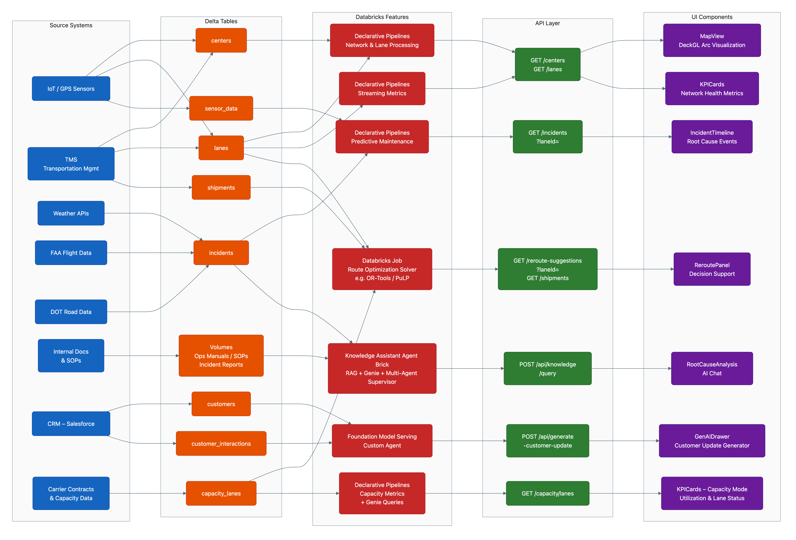

# Logistics Control Center

> **Credits:** This project is based on [josh-melton-db/logistics-control-center](https://github.com/josh-melton-db/logistics-control-center) by [Josh Melton](https://github.com/josh-melton-db). Enhanced with customer-facing documentation, parameterized configuration, and deployment improvements.

AI-powered logistics incident response application built on Databricks. Features real-time streaming analytics, natural language queries via Genie Space, and intelligent document Q&A with Knowledge Assistant.



## Features

| Feature | Description |
|---------|-------------|
| **Real-time Dashboard** | Monitor shipments, incidents, and network health with live updates |
| **AI-Powered Rerouting** | Automatic reroute suggestions when incidents occur |
| **Natural Language Analytics** | Ask questions about your data using Genie Space |
| **Document Q&A** | Query logistics SOPs and procedures via Knowledge Assistant |
| **Customer Communications** | AI-generated customer updates using Foundation Models |

## Architecture

```
┌─────────────────────────────────────────────────────────────────────────────┐
│                         Logistics Control Center                             │
├─────────────────────────────────────────────────────────────────────────────┤
│                                                                              │
│  ┌──────────────┐     ┌──────────────┐     ┌──────────────────────────────┐ │
│  │   React UI   │────▶│  FastAPI     │────▶│  Databricks Services         │ │
│  │   (Vite)     │     │  Backend     │     │  ├─ SQL Warehouse            │ │
│  └──────────────┘     └──────────────┘     │  ├─ Genie Space              │ │
│                                             │  ├─ Knowledge Assistant      │ │
│                                             │  └─ Foundation Models        │ │
│                                             └──────────────────────────────┘ │
│                                                                              │
├─────────────────────────────────────────────────────────────────────────────┤
│                          Data Pipeline (SDP)                                 │
├─────────────────────────────────────────────────────────────────────────────┤
│                                                                              │
│  ┌──────────┐     ┌──────────┐     ┌──────────┐     ┌──────────────────┐   │
│  │  Bronze  │────▶│  Silver  │────▶│   Gold   │────▶│  Serving Tables  │   │
│  │  (Raw)   │     │ (Clean)  │     │ (Agg)    │     │  + Metric Views  │   │
│  └──────────┘     └──────────┘     └──────────┘     └──────────────────┘   │
│       ▲                                                                      │
│       │                                                                      │
│  ┌────┴─────┐                                                               │
│  │ UC Volume │  ◀── Raw JSON events (shipments, incidents, sensors)        │
│  └──────────┘                                                               │
│                                                                              │
└─────────────────────────────────────────────────────────────────────────────┘
```

## One-Click Deploy

Skip the manual steps — deploy with a single command using **Claude Code** or **Databricks Genie Code**.

### Claude Code

```
/logistics-demo
```

The skill handles everything: config patching, bundle deploy, setup job, agent ID extraction, redeploy, and permissions. Choose **demo mode** (synthetic data) or **customer data adapt** (map your existing tables).

### Databricks Genie Code

Open a notebook with Genie Code and prompt:

```
Read the file at harness/SKILL.md and follow the Demo Deploy instructions.
Use catalog "my_catalog" and warehouse_id "my_warehouse_id".
```

See [`harness/README.md`](harness/README.md) for full details on both runtimes.

---

## Manual Deploy (Quick Start)

### Prerequisites

- Databricks workspace with Unity Catalog enabled
- SQL Warehouse (Serverless recommended)
- A catalog where you have `CREATE SCHEMA` permission

* [Databricks CLI](https://docs.databricks.com/dev-tools/cli/install.html) installed and authenticated

### Clone and Deploy

```bash
git clone https://github.com/archana-krishnamurthy_data/logistics-control-center.git
cd logistics-control-center
```

### Deploy (7 Steps)

| Step | Action | What to Edit |
|------|--------|--------------|
| 1 | Clone repo locally | None |
| 2 | Set `warehouse_id` + `catalog` in `databricks.yml`; set `catalog` in `app.yaml` | 2 files, 3 values |
| 3 | `databricks bundle deploy -t dev` (creates pipeline + jobs, no app yet) | None |
| 4 | `databricks bundle run logistics_setup -t dev` (~10 min) — note IDs from output | None |
| 5 | `databricks bundle run logistics_streaming_refresh -t dev` (~5 min) | None |
| 6 | Add `include: - resources/app.yml` + IDs to `databricks.yml`, redeploy + run permissions | 1 file, 3 edits |
| 7 | Access app at URL from deploy output | None |

Each value is entered **once** — warehouse ID, Genie Space ID, and KA endpoint are auto-injected into the app via `valueFrom`.

- [SETUP.md](SETUP.md) - Detailed step-by-step guide
- [CONFIG.md](CONFIG.md) - Configuration file reference

## Project Structure

```
logistics-control-center/
├── README.md                 # This file
├── SETUP.md                  # Detailed setup instructions
├── databricks.yml            # Bundle config — pipeline + jobs (infra)
├── app.yaml                  # App runtime config (startup + env vars)
├── cleanup.sh                # Full teardown script
├── resources/
│   └── app.yml               # App resource (included in Step 5)
│
├── backend/                  # FastAPI Python backend
│   ├── main.py               # App entry point
│   └── api.py                # API routes
│
├── src/                      # React TypeScript frontend
│   ├── App.tsx               # Main app component
│   ├── components/           # UI components
│   ├── pages/                # Page views
│   └── lib/                  # Utilities
│
├── databricks/               # Databricks resources
│   ├── notebooks/            # Setup and job notebooks
│   │   ├── setup_tables.sql
│   │   ├── generate_synthetic_data.ipynb
│   │   ├── create_genie_space.ipynb
│   │   ├── create_knowledge_assistant.ipynb
│   │   └── ...
│   └── pipelines/            # SDP SQL definitions
│       ├── 01_bronze.sql
│       ├── 02_silver.sql
│       └── 03_gold.sql
│
├── public/                   # Static assets
├── requirements.txt          # Python dependencies
├── package.json              # Node.js dependencies
└── *.config files            # Build configuration
```

## Configuration Files

### Databricks Configuration

| File | Purpose | Customer Edits? |
|------|---------|-----------------|
| `databricks.yml` | Bundle definition — pipeline, jobs, variables | **Yes** — warehouse_id, catalog (Step 2), include + IDs (Step 5) |
| `resources/app.yml` | App resource + permissions job | **No** — included via `databricks.yml` |
| `app.yaml` | App runtime config — startup command + env vars | **Yes** — catalog only (Step 2) |

**Changing the AI model:** The Foundation Model used for customer communications and reroute suggestions is set in `app.yaml` under `DATABRICKS_MODEL_ENDPOINT` (~line 46). To use a different model, change the value to any Foundation Model API endpoint available in your workspace (e.g. `databricks-llama-4-maverick`, `databricks-claude-sonnet-4`). Then redeploy with `databricks bundle deploy -t dev`.

### Frontend Build Configuration

| File | Purpose | Customer Edits? |
|------|---------|-----------------|
| `package.json` | Node.js dependencies and build scripts | No |
| `vite.config.ts` | Vite bundler - handles React builds, path aliases | No |
| `tailwind.config.ts` | Tailwind CSS theme, colors, animations | No |
| `postcss.config.js` | PostCSS plugins for CSS processing | No |
| `tsconfig.json` | TypeScript project references (points to app/node configs) | No |
| `tsconfig.app.json` | TypeScript settings for React source code | No |
| `tsconfig.node.json` | TypeScript settings for Vite config | No |

### What Each Config Does

**`package.json`** - Node.js project manifest
- Defines dependencies (React, Vite, Tailwind, deck.gl for maps)
- Build scripts: `npm run dev` (local), `npm run build` (production)
- No customer changes needed

**`tsconfig.json`** - TypeScript root config
- References `tsconfig.app.json` for source code
- References `tsconfig.node.json` for build tools
- Enables project references for faster builds

**`tsconfig.app.json`** - Frontend TypeScript settings
- Target: ES2022 for modern JavaScript
- Path alias: `@/*` maps to `./src/*` for cleaner imports
- Strict mode enabled for type safety

**`tsconfig.node.json`** - Build tooling TypeScript settings
- Used only for `vite.config.ts`
- Node.js types for build-time scripts

> **Note:** JSON files don't support comments. See [CONFIG.md](CONFIG.md) for detailed explanations of each file.

## What Gets Deployed

| Resource | Name | Description |
|----------|------|-------------|
| **Pipeline** | `logistics-control-center-streaming` | Bronze/Silver/Gold data processing |
| **Job** | `logistics-control-center-setup` | One-time setup (data, agents) |
| **Job** | `logistics-control-center-streaming-refresh` | Scheduled data updates (5 min) |
| **Job** | `logistics-control-center-app-permissions` | Grant app UC access |
| **App** | `logistics-incident-response` | React + FastAPI application |
| **Genie Space** | `Logistics Control Center Metrics` | Natural language analytics |
| **Knowledge Assistant** | `ka-*-endpoint` | Document Q&A |

## Customization

### Using Your Own Data

1. Replace the synthetic data generation in `generate_synthetic_data.ipynb`
2. Update the Bronze layer schema in `01_bronze.sql` to match your data
3. Adjust Silver/Gold transformations for your business logic
4. Update Genie Space instructions in `create_genie_space.ipynb`

### Adding New Metrics

1. Add new views in `create_helper_metric_views.sql`
2. Update the Genie Space with new tables
3. Add corresponding API endpoints in `backend/api.py`
4. Create frontend components in `src/components/`

## Troubleshooting

| Issue | Solution |
|-------|----------|
| `Catalog not found` | Ensure you have access to the catalog specified in `databricks.yml` |
| `Warehouse not found` | Verify warehouse ID and that you have CAN_USE permission |
| `App won't start` | Check logs at `https://<app-url>/logz` |
| `Genie Space errors` | Ensure metric views were created successfully |
| `Can't edit/delete Genie Space` | Grant yourself CAN_MANAGE: Genie → Your space → Share → Add your email → Can Manage. See [SETUP.md](SETUP.md#genie-space-permissions) for details |

## License

TBD

## Contributing

TBD
